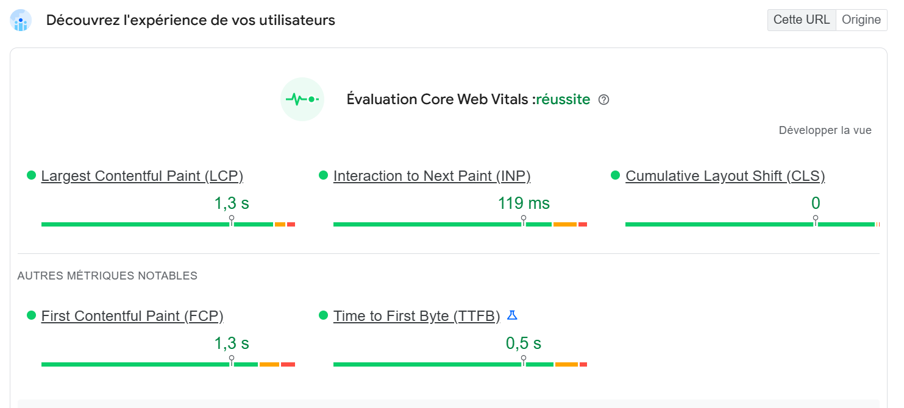

# Projet Star Eater

Ce projet consiste à donner un site web pour l’agence “Star Eater”, une mini agence innovante qui montre les ebooks que les cofondateurs réalisent pendant leur temps libre. Le site contient une backoffice qui leur permet d’ajouter les détails sur les ebooks qu’ils ont créée et peuvent gérer les messages envoyés par leurs fans. Start Eater facilite la découverte et la mise en valeur des créations littéraires. 
Leur objectif n’est pas de vendre des ebooks, mais d’inciter les visiteurs du sites à acheter grâce au synopsis qu’ils mettent pour leurs ebooks.

## Technologies utilisées :

- React
- Next.js
- PostgreSQL

## Fonctionnalités implémentées :

- Gestion du backoffice :
- Ajout/Suppression de projets
- Gestion des messages envoyés via formulaire de contact
- Envoi de messages
- Filtrage des ebooks par type de livre

## Choix de conception et justification de l'utilisation des RSC

Pour développer Star Eater, l'utilisation des Ressources Server Components (RSC) a été notre choix pour optimiser les performances et l’expérience utilisateur. Grâce à cela, le temps de chargement a été minimisé pour le rendu des données liées aux ebooks. De plus, les RSC offrent une meilleure scalabilité et maintenabilité du projet en limitant le JavaScript envoyé au navigateur, garantissant ainsi une expérience fluide et rapide, même avec un grand volume d’ebooks affichés.

Ainsi, ce choix technique répond donc à un double objectif : améliorer la réactivité de l’application tout en assurant une consommation optimisée des ressources côté serveur et client.

## Rapport de performances :

Nom du projet : Star Eater

URL du Vercel : [https://star-eater-new-2-k9e7sh3xn-lotids-projects.vercel.app/](https://star-eater-new-2-k9e7sh3xn-lotids-projects.vercel.app/)

URL du site web : [https://star-eater-new-2.vercel.app/](https://star-eater-new-2.vercel.app/)

Analysé : le 30/01/2025 à 16h37 avec pageSpeed Insight

Les performances du site sont moyennes.

Les métriques LCP et TBT sont au plus bas.

LCP
Cela peut s’expliquer assez facilement.

Nous avons utilisé des images assez lourds en background de la hero section et de la values section dans la page accueil bien qu’elles soient en webp par contre on a pas mis de lazy loading ni de preload.

On a pas assez optimisé les fichiers css et js.

TBT

On a pas minifié le CSS et on pourrait réorganiser pour tout mettre en tailwindcss voir si ça marche mieux au lieu de faire du CSS et Tailwindcss

On a des requetes api côté backoffice qui pourraient peut-être impacter les performances
